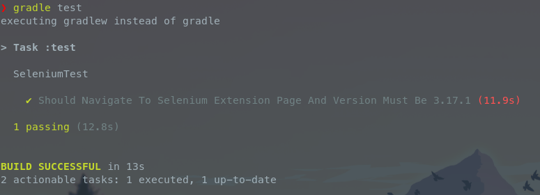

# Atividade Selenium

Aula 4 "ESD21 - Automated Software Testing" - Atividade Selenium

## Desafio

> Criar um projeto que utilize Selenium, passos que o caso de teste deve executar:
> 1. Abrir o browser
> 2. Acessar a Chrome Web Store
> 3. Buscar por “selenium ide”
> 4. Acessar a página da extensão Selenium IDE
> 5. Obter na tela a versão da extensão
> 6. Criar um Assert validando a versão
> 7. Subir os fontes no Github e enviar no classroom
> OBS: Pode subir o arquivo .side do Selenium ou codificar usando JUnit.

## Como rodar os testes

```sh
git clone https://github.com/luis-sena/automated-software-testing-atividade-selenium.git && cd automated-software-testing-atividade-selenium

gradle test
```


